# SOC Monitoring Home Lab with Wazuh

A hands-on cybersecurity home lab focused on endpoint monitoring, network intrusion detection, file integrity monitoring, threat intelligence enrichment, and security configuration assessment.

---

## Overview

This project simulates a small SOC environment using **Wazuh as the central security monitoring platform**, with a Windows 11 endpoint monitored by the Wazuh Agent.

The Windows endpoint also runs **Suricata** for network intrusion detection, while **VirusTotal** is integrated with Wazuh to provide threat intelligence enrichment.

The laboratory also includes **File Integrity Monitoring (FIM)** through Wazuh Syscheck and **Security Configuration Assessment (SCA)** using the CIS Microsoft Windows 11 Enterprise Benchmark.

The main objective was to build a practical environment where security events could be generated, detected, investigated, and enriched using multiple security tools.

---

## Objectives

- Deploy and configure a Wazuh-based security monitoring environment.
- Monitor a Windows 11 endpoint using the Wazuh Agent.
- Collect and investigate security events through Wazuh Threat Hunting.
- Deploy Suricata on the monitored endpoint for network traffic detection.
- Test custom Suricata rules and Emerging Threats rules.
- Configure File Integrity Monitoring on the Windows endpoint.
- Integrate VirusTotal with Wazuh for threat intelligence enrichment.
- Perform Security Configuration Assessment against the CIS Windows 11 Enterprise Benchmark.
- Practice the analysis and investigation of security events in a SOC-oriented environment.

---

## Lab Architecture

```text
                    VirtualBox Environment

        ┌──────────────────────────────────┐
        │          Xubuntu VM              │
        │                                  │
        │          Wazuh Platform          │
        │   ┌──────────────────────────┐   │
        │   │ Wazuh Manager            │   │
        │   │ Wazuh Indexer            │   │
        │   │ Wazuh Dashboard          │   │
        │   └──────────────────────────┘   │
        └────────────────┬─────────────────┘
                         │
                    Wazuh Agent
                         │
        ┌────────────────▼─────────────────┐
        │        Windows 11 VM             │
        │                                  │
        │   ┌──────────────────────────┐   │
        │   │ Wazuh Agent              │   │
        │   │ Suricata                 │   │
        │   │ File Integrity Monitoring│   │
        │   └──────────────────────────┘   │
        └──────────────────────────────────┘
                         │
                         ▼
                  VirusTotal API
```

---

## Technologies

| Technology | Purpose |
|---|---|
| **Wazuh** | Security monitoring and SIEM/XDR platform |
| **Wazuh Agent** | Endpoint monitoring on Windows 11 |
| **Suricata** | Network intrusion detection |
| **VirusTotal** | Threat intelligence enrichment |
| **Syscheck / FIM** | File Integrity Monitoring |
| **SCA** | Security Configuration Assessment |
| **CIS Benchmark** | Windows 11 security configuration assessment |
| **VirtualBox** | Virtualized laboratory environment |
| **Xubuntu** | Wazuh server environment |
| **Windows 11** | Monitored endpoint |

---

## Lab Environment

The laboratory was built using virtual machines in VirtualBox.

### Wazuh Server

- Operating System: Xubuntu
- Wazuh Manager
- Wazuh Indexer
- Wazuh Dashboard

### Monitored Endpoint

- Operating System: Windows 11
- Wazuh Agent
- Suricata
- File Integrity Monitoring

The Windows endpoint was configured as the monitored system and generated the events used throughout the laboratory.

---

## Wazuh Manager & Windows Endpoint

The Wazuh platform was deployed on the Xubuntu virtual machine using the Wazuh quickstart deployment.

The Windows 11 virtual machine was subsequently registered as a Wazuh Agent and successfully connected to the Manager.

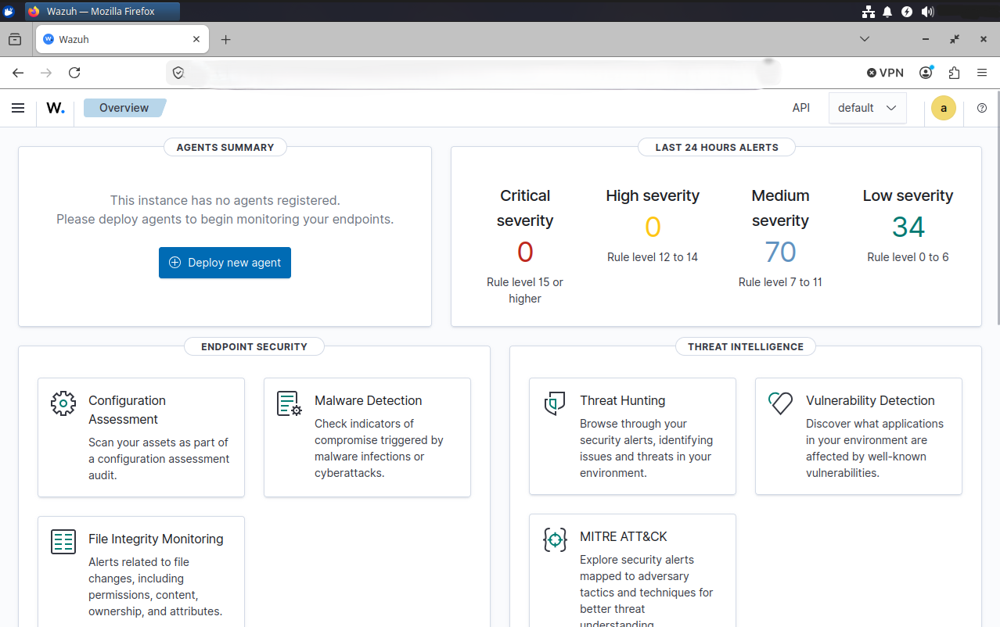

The dashboard provides a centralized view of the security events and information collected from the monitored environment.

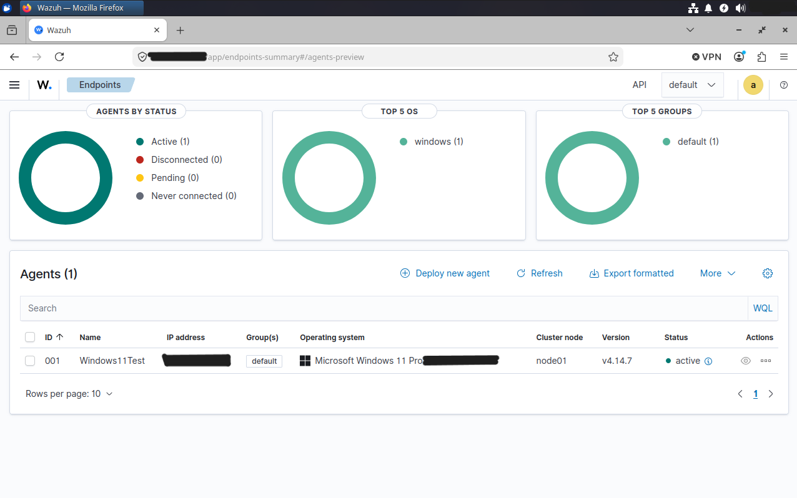

The Windows 11 endpoint appears as an active Wazuh Agent, confirming successful communication between the endpoint and the Wazuh Manager.

---

## Suricata Network Detection

Suricata was deployed on the Windows 11 endpoint to provide network intrusion detection capabilities.

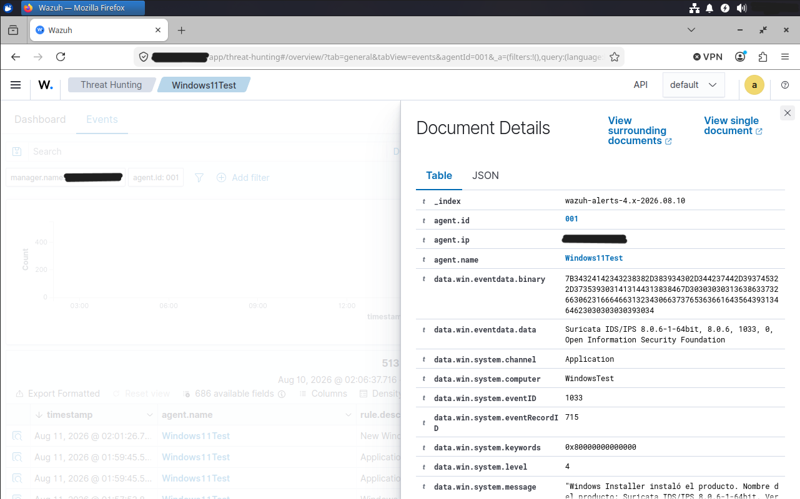

The laboratory included both **custom Suricata rules** and **Emerging Threats rules**.

The configuration was tested by generating controlled network traffic and verifying that Suricata produced security events that could be observed through Wazuh.

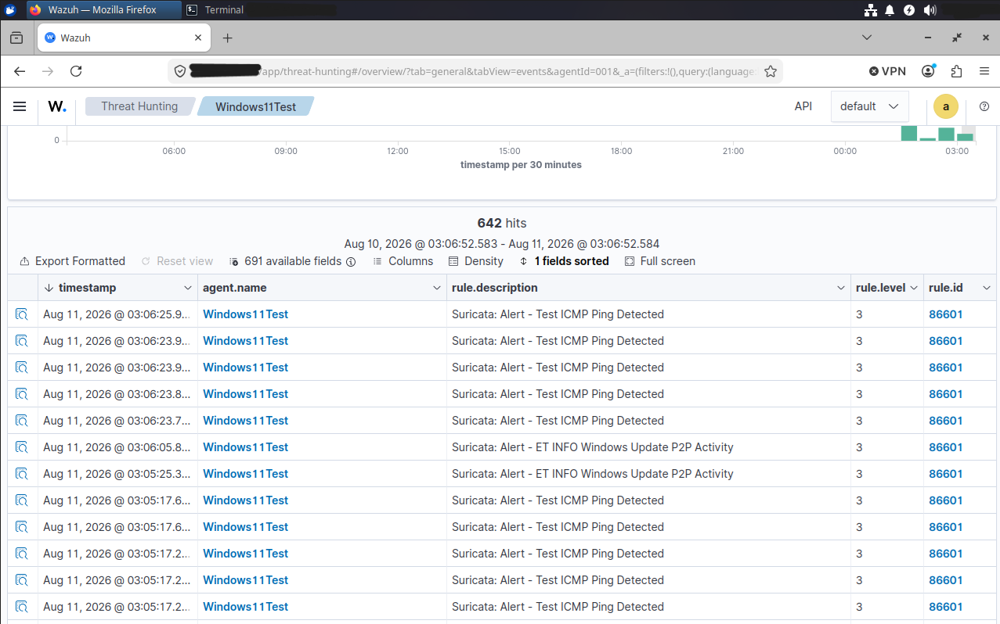

The alerts include detections generated by Suricata, including a controlled ICMP ping test.

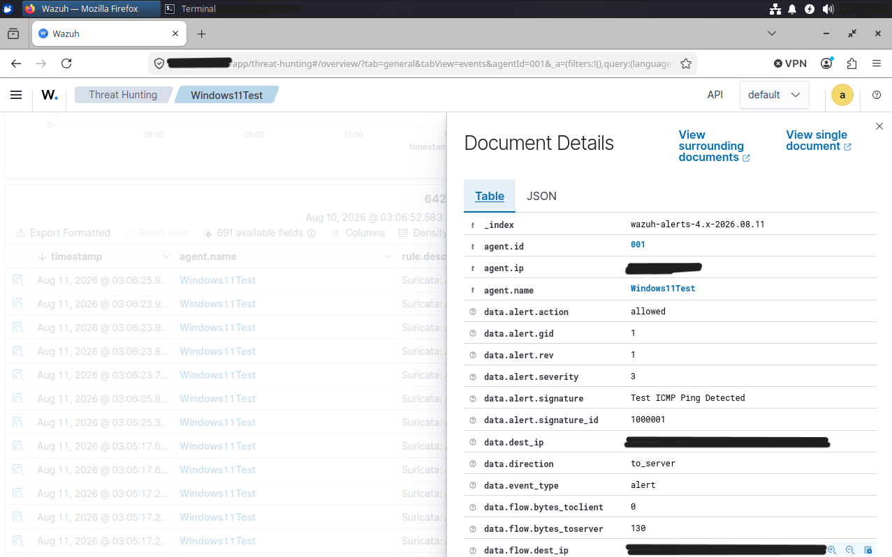

The individual alert can be inspected through Wazuh to review information such as the signature, severity, direction, protocol, and other event fields.

### Additional Suricata Evidence

The following screenshots provide additional details about the Suricata events and their metadata.

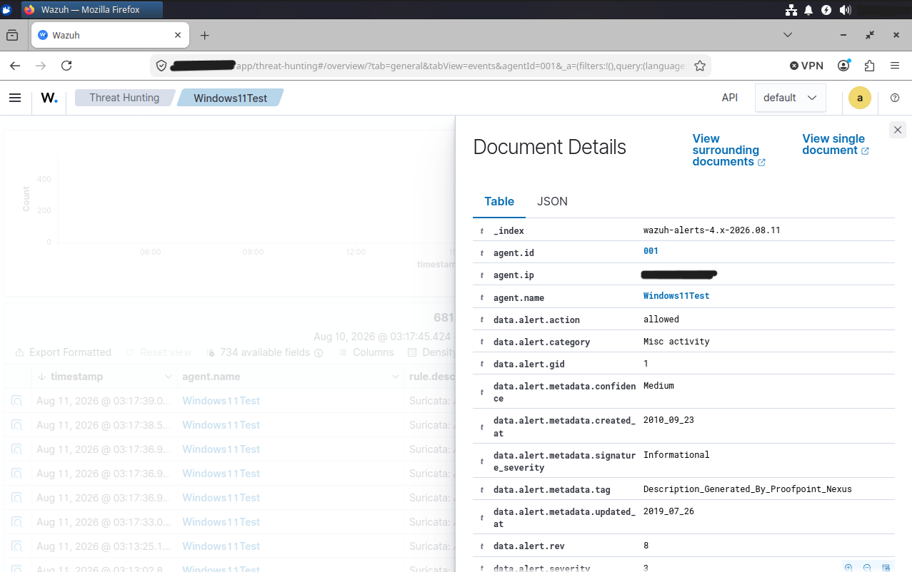

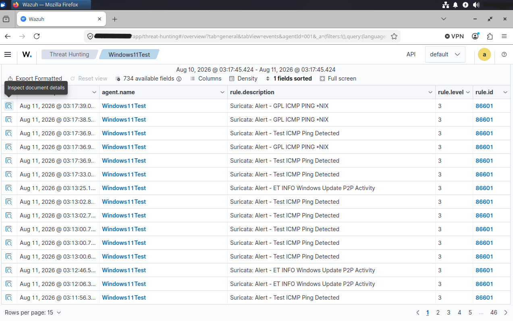

These screenshots are included as supporting evidence and are not required to understand the main detection workflow.

---

## File Integrity Monitoring

Wazuh Syscheck was configured to monitor the Windows user's `Downloads` directory.

A controlled test was performed by creating a file in the monitored directory. Wazuh successfully detected the new file and generated a File Integrity Monitoring event.

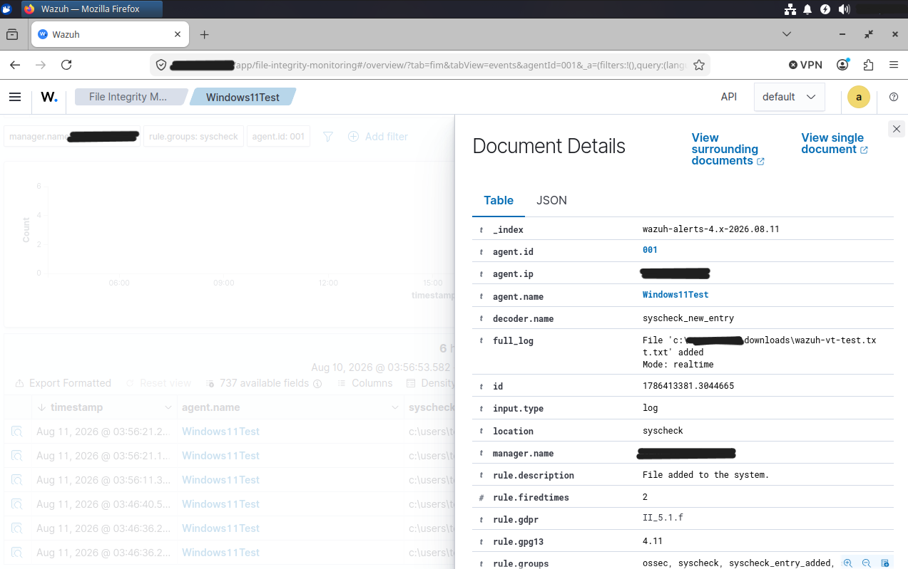

This demonstrates the ability of the Wazuh Agent to detect file system changes and forward the resulting security events to the Wazuh Manager.

---

## VirusTotal Threat Intelligence

VirusTotal was integrated with Wazuh to enrich file-related security events with threat intelligence information.

A controlled **EICAR test file** was used to validate the integration without using real malware.

The resulting event included file identification information and a VirusTotal analysis result.

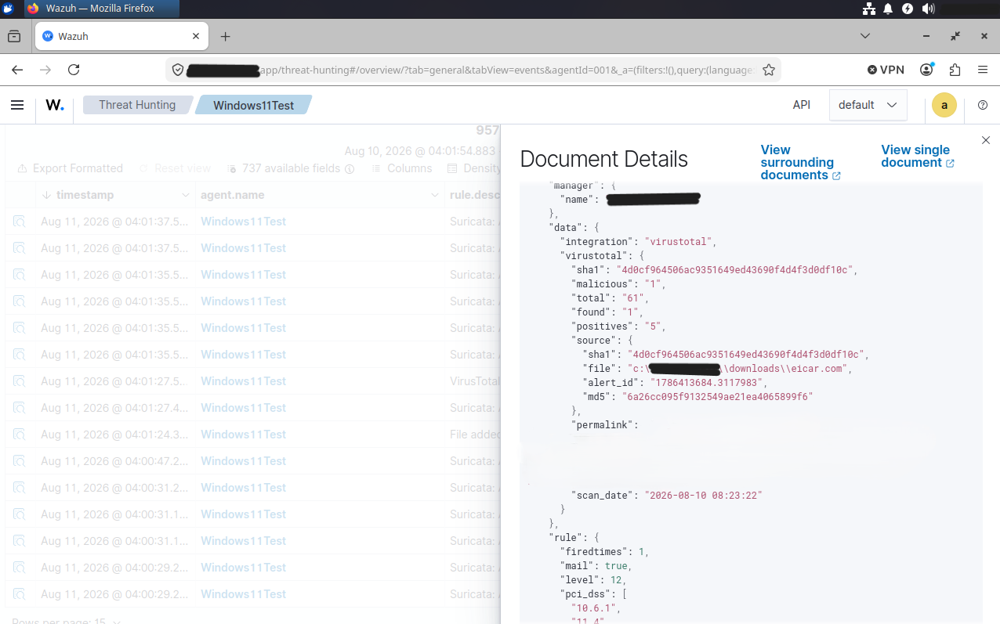

The event shows the VirusTotal integration and its returned analysis, including the file hash and malicious classification.

This demonstrates the following workflow:

```text
File Activity
     │
     ▼
Wazuh Syscheck
     │
     ▼
File Hash / Indicator
     │
     ▼
VirusTotal
     │
     ▼
Threat Intelligence Result
     │
     ▼
Wazuh Threat Hunting
```

The API key used for the integration is not included in this repository.

---

## Security Configuration Assessment

Wazuh SCA was used to assess the Windows 11 endpoint against the **CIS Microsoft Windows 11 Enterprise Benchmark**.

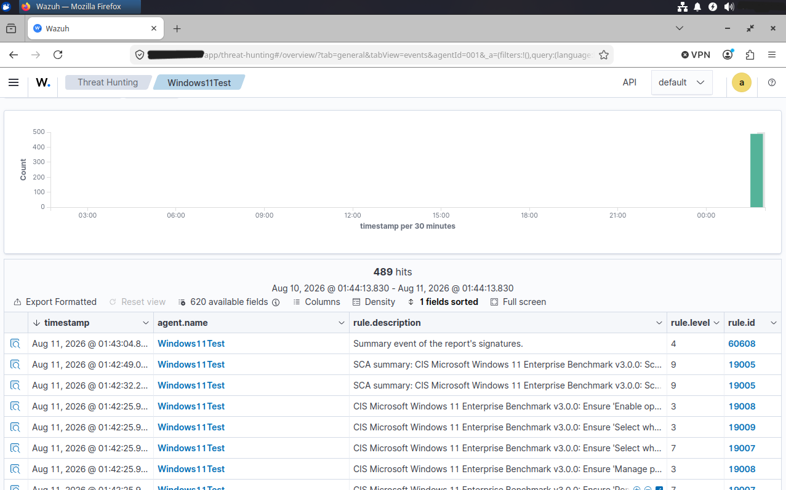

The assessment generated results covering multiple security configuration checks.

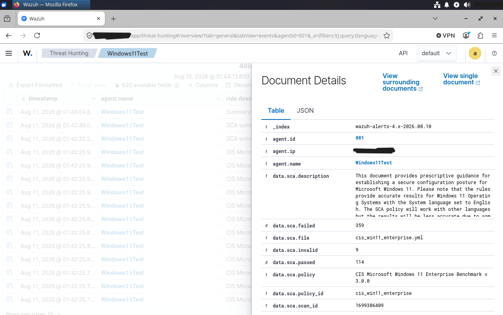

The results include passed, failed, and invalid checks, providing visibility into the security configuration of the Windows endpoint.

This part of the laboratory provided practical experience with security posture assessment in addition to event detection and monitoring.

---

## Detection & Analysis Workflow

The laboratory combines several security capabilities into a single monitoring workflow:

```text
                 Windows 11 Endpoint
                         │
          ┌──────────────┼──────────────┐
          │              │              │
          ▼              ▼              ▼
      Wazuh Agent     Suricata       Syscheck
          │              │              │
          └──────────────┼──────────────┘
                         │
                         ▼
                   Wazuh Manager
                         │
                         ▼
                  Wazuh Dashboard
                         │
              ┌──────────┴──────────┐
              │                     │
              ▼                     ▼
       Threat Hunting             SCA
              │
              ▼
         VirusTotal
       Threat Intelligence
```

This allowed the laboratory to cover several stages of a SOC workflow:

- Endpoint monitoring
- Event collection
- Network intrusion detection
- File integrity monitoring
- Threat intelligence enrichment
- Security configuration assessment
- Event inspection and analysis

---

## Key Takeaways

This laboratory provided hands-on experience with several technologies and concepts commonly used in security monitoring environments.

Key areas practiced include:

- Deploying and configuring Wazuh.
- Registering and monitoring a Windows endpoint.
- Investigating security events through Threat Hunting.
- Working with Suricata alerts and rules.
- Using File Integrity Monitoring to detect file system changes.
- Integrating external threat intelligence through VirusTotal.
- Performing security configuration assessments using CIS benchmarks.
- Correlating information from different security monitoring components.

The laboratory was built as a practical environment for continuing to develop skills in **SOC operations, security monitoring, detection, and incident analysis**.

---

## Disclaimer

This project was developed as an isolated cybersecurity laboratory for educational and portfolio purposes.

All security testing and generated activity were performed within the controlled virtualized environment.

No real-world systems were targeted.

The EICAR test file was used exclusively as a safe antivirus test artifact.

Sensitive information such as API keys, credentials, and private network information has been removed or anonymized from the published project.

---

## Author

**Santiago Perez**

Cybersecurity / SOC profile with a background in Java backend development.

[LinkedIn](https://www.linkedin.com/in/santiagoeper3z)
